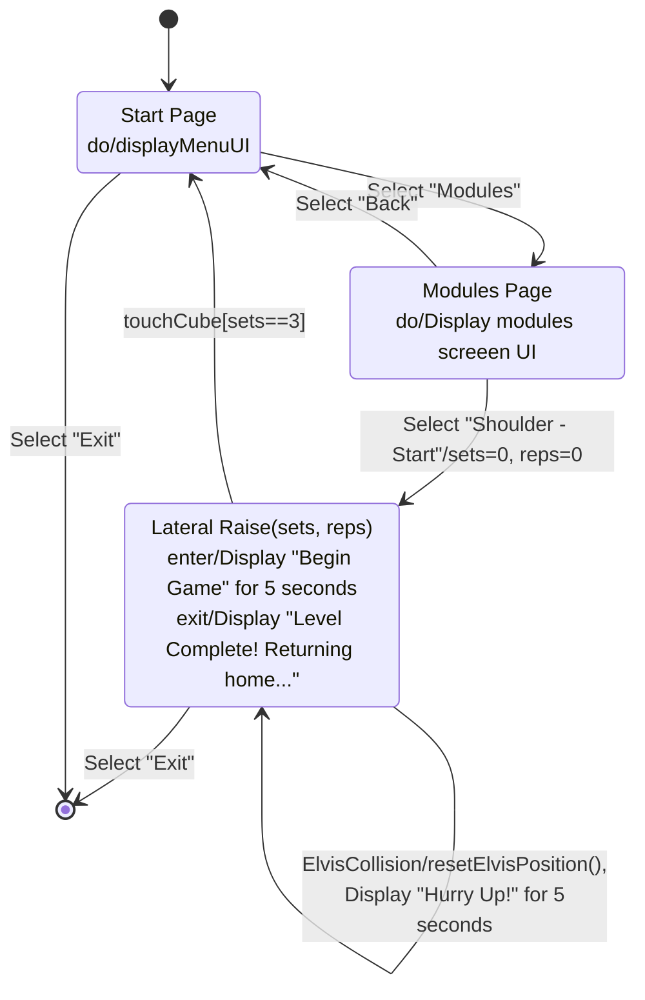

```mermaid
stateDiagram-v2
    [*] --> start
    start:Start Page <br/>do/displayMenuUI
    start --> modules: Select "Modules"
    modules: Modules Page<br/>do/Display modules screeen UI

    modules -->start: Select "Back"


    LateralRaiseStart: Lateral Raise(sets, reps)<br/>enter/Display "Begin Game" for 5 seconds<br/>exit/Display "Level Complete! Returning home..."

    LateralRaiseStart -->[*]: Select "Exit"
    start --> [*]: Select "Exit"

    LateralRaiseStart -->start:touchCube[sets==3]

    modules-->LateralRaiseStart: Select "Shoulder - Start"/sets=0, reps=0

    LateralRaiseStart -->LateralRaiseStart: touchCube[reps!=3]/reps++
    LateralRaiseStart -->LateralRaiseStart: touchCube[reps==3]/<br/>sets++, reps=0

    LateralRaiseStart-->LateralRaiseStart: ElvisCollision/resetElvisPosition(),<br/> Display "Hurry Up!" for 5 seconds


```
