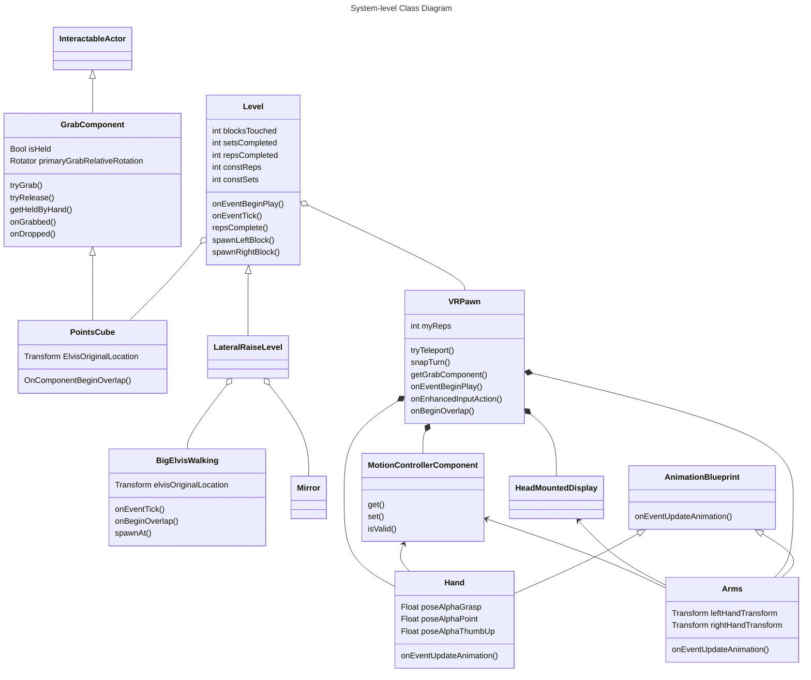

Could also add mirror

```mermaid
---
title: System-level Class Diagram
---
classDiagram
class PointsCube{
    Transform ElvisOriginalLocation
    OnComponentBeginOverlap()
}
InteractableActor <|-- GrabComponent
class GrabComponent{
    Bool isHeld
    Rotator primaryGrabRelativeRotation
    tryGrab()
    tryRelease()
    getHeldByHand()
    onGrabbed()
    onDropped()
}


class VRPawn{
    tryTeleport()
    snapTurn()
    getGrabComponent()
    onEventBeginPlay()
    onEnhancedInputAction()
    onBeginOverlap()
    int myReps

}
class BigElvisWalking{
    onEventTick()
    Transform elvisOriginalLocation
    onBeginOverlap()
    spawnAt()
}

class Mirror { }

LateralRaiseLevel o-- Mirror

class MotionControllerComponent{
    get()
    set()
    isValid()
}

class AnimationBlueprint {
    onEventUpdateAnimation()
}

class Arms {
    Transform leftHandTransform
    Transform rightHandTransform
    onEventUpdateAnimation()
}

class Level {
    onEventBeginPlay()
    onEventTick()
    repsComplete()
    spawnLeftBlock()
    spawnRightBlock()
    int blocksTouched
    int setsCompleted
    int repsCompleted
    int constReps
    int constSets
}

class LateralRaiseLevel { }
Level <|-- LateralRaiseLevel

class Hand {
    Float poseAlphaGrasp
    Float poseAlphaPoint
    Float poseAlphaThumbUp
    onEventUpdateAnimation()
}

AnimationBlueprint <|-- Hand
AnimationBlueprint <|-- Arms

class HeadMountedDisplay{ }


VRPawn *-- MotionControllerComponent
VRPawn *-- Arms
MotionControllerComponent <-- Hand
VRPawn *-- Hand
VRPawn *-- HeadMountedDisplay
HeadMountedDisplay <-- Arms
MotionControllerComponent <-- Arms
LateralRaiseLevel o--BigElvisWalking
Level o-- PointsCube
Level o-- VRPawn
GrabComponent <|-- PointsCube

```
