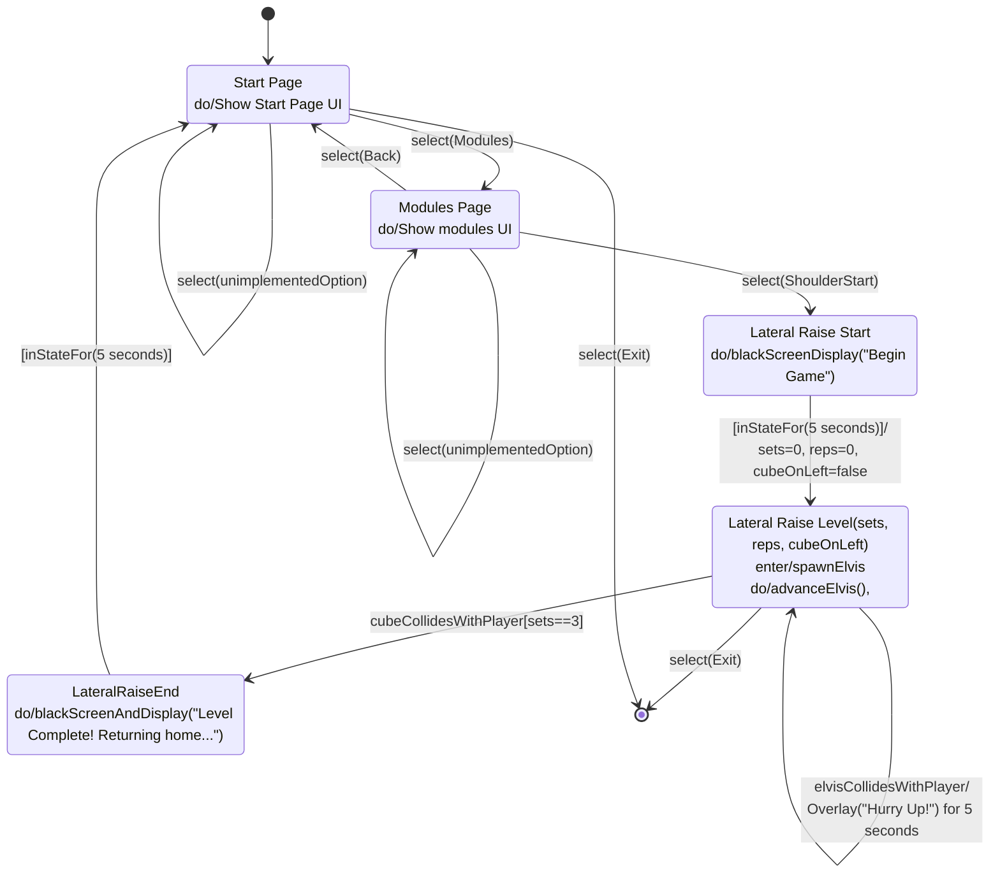

```mermaid
stateDiagram-v2
    [*] --> start

    start:Start Page <br/>do/Show Start Page UI
    start --> modules: select(Modules)
    modules: Modules Page<br/>do/Show modules UI
    start --> start: select(unimplementedOption)
    modules -->start: select(Back)

    modules --> modules: select(unimplementedOption)
   LateralRaiseLevel -->LateralRaiseEnd:cubeCollidesWithPlayer[sets==3]

    LateralRaiseStart: Lateral Raise Start<br/>do/blackScreenDisplay("Begin Game")

    LateralRaiseStart --> LateralRaiseLevel: [inStateFor(5 seconds)]/<br/>sets=0, reps=0, cubeOnLeft=false

    LateralRaiseLevel: Lateral Raise Level(sets, reps, cubeOnLeft)<br/>enter/spawnElvis<br/>do/advanceElvis(),


    LateralRaiseEnd --> start: [inStateFor(5 seconds)]

    LateralRaiseLevel -->[*]: select(Exit)
    start --> [*]: select(Exit)


    modules-->LateralRaiseStart: select(ShoulderStart)

    LateralRaiseLevel -->LateralRaiseLevel: cubeCollidesWithPlayer[reps!=3]/<br/>reps++, cubeOnLeft=!cubeOnLeft
    LateralRaiseLevel -->LateralRaiseLevel: cubeCollidesWithPlayer[reps==3]/<br/>sets++, reps=0, cubeOnLeft=!cubeOnLeft

    LateralRaiseLevel-->LateralRaiseLevel: elvisCollidesWithPlayer/<br/>Overlay("Hurry Up!") for 5 seconds

    LateralRaiseEnd: LateralRaiseEnd<br/>do/blackScreenAndDisplay("Level Complete! Returning home...")


```
