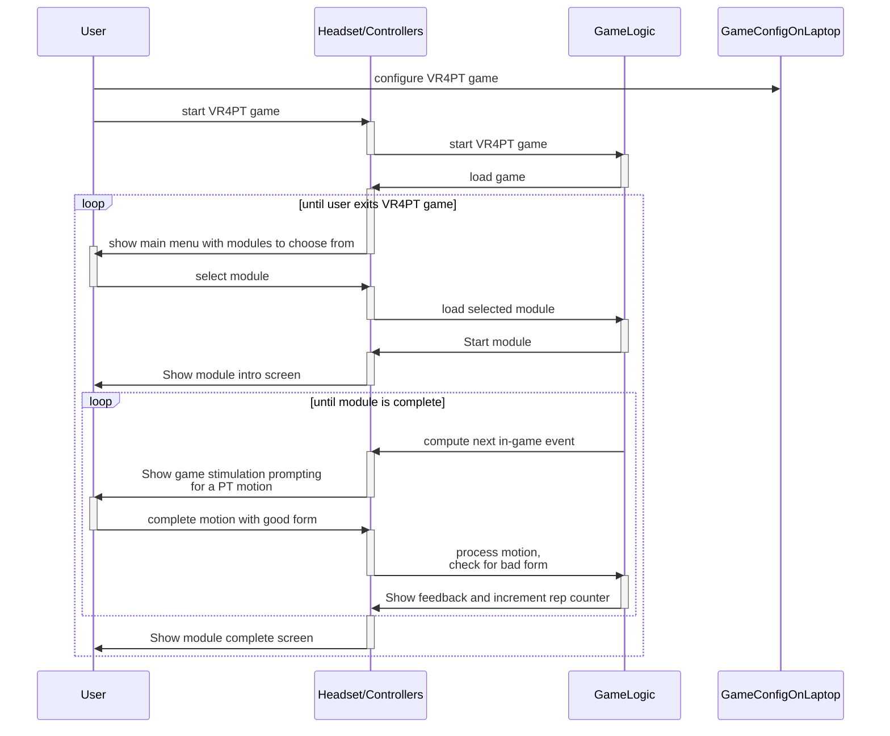

# Expected Usage

```mermaid
sequenceDiagram
    participant User
    participant Headset/Controllers
    participant GameLogic
    participant GameConfigOnLaptop

    User ->> GameConfigOnLaptop: configure VR4PT game

    User ->> Headset/Controllers: start VR4PT game
    activate Headset/Controllers

    Headset/Controllers ->> GameLogic: start VR4PT game
    deactivate Headset/Controllers
    activate GameLogic

    GameLogic ->> Headset/Controllers: load game
    deactivate GameLogic
    activate Headset/Controllers

    loop until user exits VR4PT game
    Headset/Controllers ->> User: show main menu with modules to choose from
    activate User
    deactivate Headset/Controllers

    User ->> Headset/Controllers: select module
    deactivate User
    activate Headset/Controllers

    Headset/Controllers ->> GameLogic: load selected module
    deactivate Headset/Controllers
    activate GameLogic

    GameLogic ->> Headset/Controllers: Start module
    deactivate GameLogic
    activate Headset/Controllers

    Headset/Controllers ->> User: Show module intro screen
    deactivate Headset/Controllers

    loop until module is complete

    GameLogic ->> Headset/Controllers: compute next in-game event
    activate Headset/Controllers


    Headset/Controllers ->> User: Show game stimulation prompting <br/> for a PT motion
    deactivate Headset/Controllers
    activate User

    User->> Headset/Controllers: complete motion with good form
    deactivate User
    activate Headset/Controllers

    Headset/Controllers ->> GameLogic: process motion, <br/> check for bad form
    deactivate Headset/Controllers
    activate GameLogic

    GameLogic ->> Headset/Controllers: Show  feedback and increment rep counter
    deactivate GameLogic

    end

    activate Headset/Controllers
    Headset/Controllers ->> User: Show module complete screen
    deactivate Headset/Controllers

    end

```

# Errors
